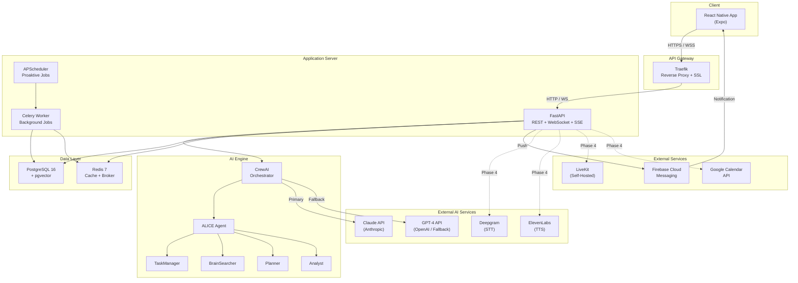
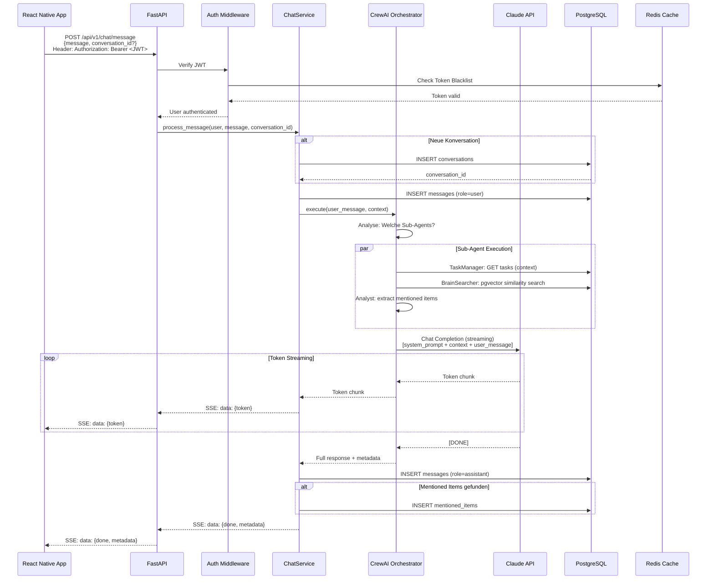
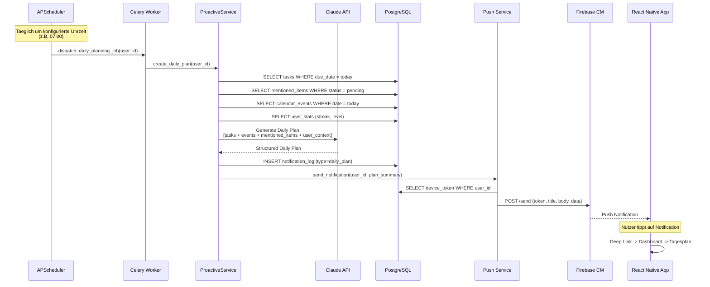
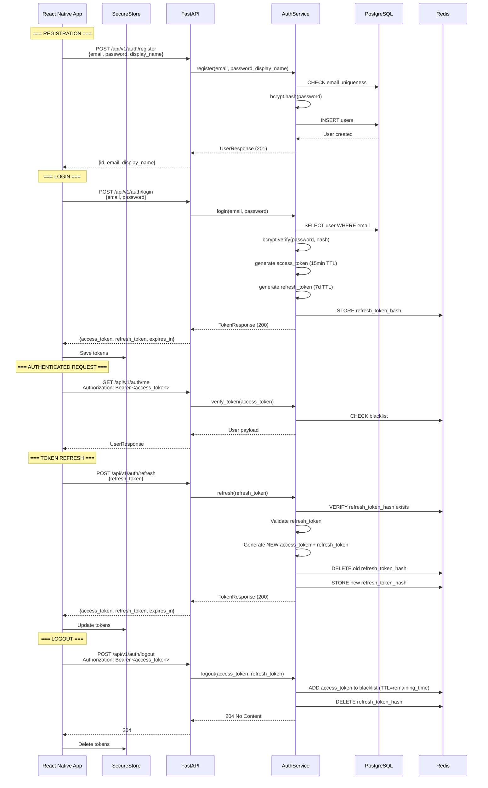
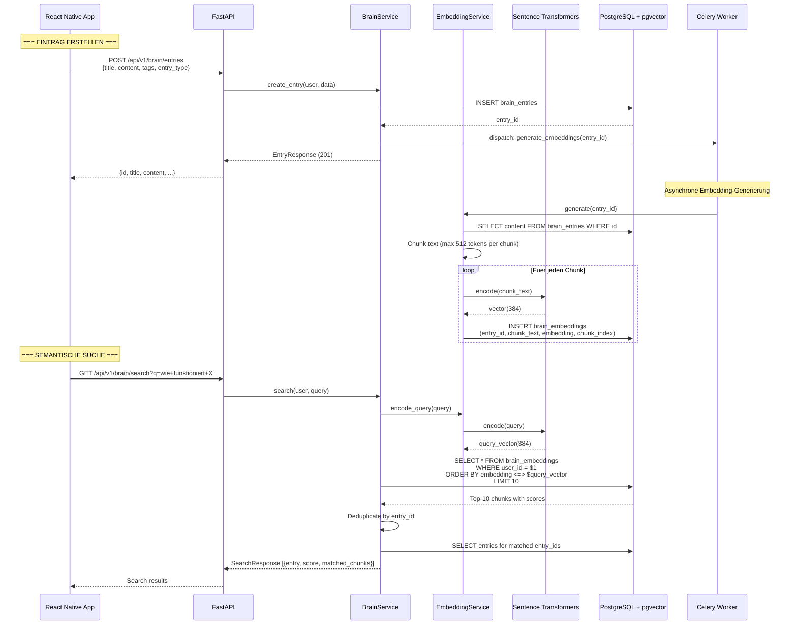
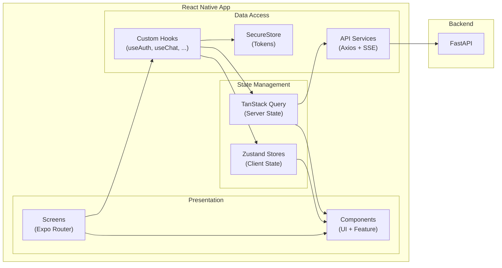
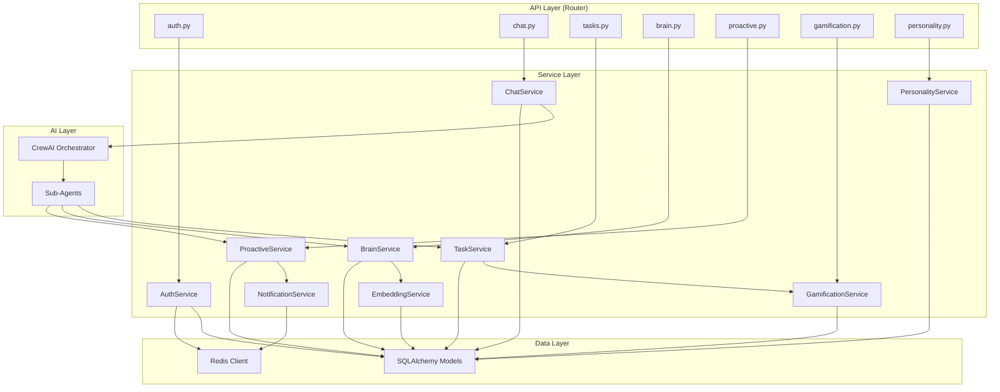

# ALICE -- Systemarchitektur

**Version:** 1.0
**Datum:** 2026-02-06
**Status:** Entwurf
**Autor:** Architect Agent

---

## Inhaltsverzeichnis

1. [Ueberblick](#1-ueberblick)
2. [5-Schicht-Architektur](#2-5-schicht-architektur)
3. [System-Uebersicht (Diagramm)](#3-system-uebersicht)
4. [Datenfluss-Diagramme](#4-datenfluss-diagramme)
5. [Backend-Projektstruktur](#5-backend-projektstruktur)
6. [Frontend-Projektstruktur](#6-frontend-projektstruktur)
7. [Komponentenarchitektur](#7-komponentenarchitektur)
8. [Kommunikationsprotokolle](#8-kommunikationsprotokolle)
9. [Sicherheitsarchitektur](#9-sicherheitsarchitektur)
10. [Skalierungsstrategie](#10-skalierungsstrategie)
11. [Deployment-Architektur](#11-deployment-architektur)

---

## 1. Ueberblick

ALICE (Adaptive Living Intelligence & Cognitive Enhancement) ist eine KI-gestuetzte Personal Assistant App fuer Menschen mit ADHS. Die Architektur folgt einem 5-Schicht-Modell mit klarer Trennung zwischen mobiler Applikation (React Native / Expo), REST+WebSocket API (FastAPI), AI-Engine (CrewAI), Datenzugriff (SQLAlchemy / Redis / pgvector) und Infrastruktur (Docker / Coolify / PostgreSQL).

### Designprinzipien

- **Separation of Concerns:** Jede Schicht hat eine klar definierte Verantwortung.
- **Stateless API:** Der API-Server haelt keinen Session-State. Authentifizierung erfolgt ueber JWT.
- **Event-Driven Processing:** Proaktive Features und Background-Jobs laufen entkoppelt ueber Celery/Redis.
- **AI-First Architecture:** Die CrewAI-Engine ist kein Addon, sondern zentraler Bestandteil der Business Logic.
- **Mobile-First:** Die primaere Nutzerschnittstelle ist die React Native App. Es gibt kein Web-Frontend.
- **Privacy by Design:** Minimale Datenspeicherung, Verschluesselung at rest und in transit.

---

## 2. 5-Schicht-Architektur

### Schicht 1: Presentation Layer (React Native + Expo)

**Verantwortung:** Darstellung, Nutzerinteraktion, lokaler State, Offline-Queue.

| Komponente | Technologie | Zweck |
|---|---|---|
| Navigation | Expo Router | File-based Tab- und Stack-Navigation |
| UI Framework | NativeWind (Tailwind CSS) | Konsistentes Styling, Dark/Light Mode |
| Client State | Zustand | Auth-State, UI-State, Preferences |
| Server State | TanStack Query | API-Daten-Caching, Invalidierung, Pagination |
| Formulare | React Hook Form + Zod | Validierung, Type-safe Formulare |
| API Client | Axios / fetch | HTTP + WebSocket Kommunikation |
| Secure Storage | expo-secure-store | JWT Token Storage |
| Push Notifications | expo-notifications + FCM | Proaktive Benachrichtigungen |

**Regeln:**
- Kein Business Logic im Frontend. Das Frontend ruft Services ueber die API auf.
- Alle API-Aufrufe laufen ueber den zentralen API Client mit Auth-Interceptor.
- Offline-Faehigkeit wird ueber eine lokale Queue realisiert, die bei Reconnect synchronisiert.

### Schicht 2: API Layer (FastAPI REST + WebSocket)

**Verantwortung:** Request-Handling, Routing, Validierung, Authentifizierung, Rate Limiting, Response Serialization.

| Komponente | Technologie | Zweck |
|---|---|---|
| Web Framework | FastAPI 0.110+ | Async REST API + WebSocket |
| Schema Validierung | Pydantic v2 | Request/Response Schemas |
| Auth Middleware | python-jose + bcrypt | JWT Verification, Password Hashing |
| Rate Limiting | slowapi | Endpoint-basiertes Rate Limiting |
| CORS | fastapi.middleware.cors | Cross-Origin Konfiguration |
| OpenAPI | FastAPI auto-gen | Swagger/ReDoc Dokumentation |
| Streaming | SSE (sse-starlette) | Token-by-Token Chat Streaming |
| WebSocket | FastAPI WebSocket | Echtzeit-Kommunikation |

**Regeln:**
- Alle Endpoints sind unter `/api/v1/` versioniert.
- Jeder Endpoint hat ein Pydantic Request- und Response-Schema.
- Auth-geschuetzte Endpoints nutzen `Depends(get_current_user)`.
- Rate Limiting ist auf allen oeffentlichen Endpoints aktiv.

### Schicht 3: Business Logic Layer (Services + CrewAI Agents)

**Verantwortung:** Domaenlogik, AI-Orchestrierung, Background-Jobs, Proaktive Features.

| Komponente | Technologie | Zweck |
|---|---|---|
| Service Layer | Python Klassen | Business Logic (ChatService, TaskService, BrainService, etc.) |
| AI Orchestrierung | CrewAI | Multi-Agent Koordination |
| Primaeres LLM | Claude API (Anthropic) | Hauptmodell fuer Chat, Analyse, Extraktion |
| Fallback LLM | GPT-4 (OpenAI) | Fallback bei Claude-Ausfall |
| Embedding | Sentence Transformers | Vektor-Embedding-Generierung (384 Dimensionen) |
| Background Jobs | Celery + Redis | Asynchrone, entkoppelte Verarbeitung |
| Scheduled Jobs | APScheduler | Zeitgesteuerte proaktive Features |
| Push Service | Expo Push API | Notification-Versand |
| Plugin Runtime | Plugin Base Class | Dynamisches Plugin-Loading und -Ausfuehrung |

**CrewAI Agent-Architektur:**

```
ALICE Orchestrator (Haupt-Agent)
|
+-- TaskManager Agent
|   Aufgabe: Task CRUD, Breakdown, Priorisierung
|   Tools: create_task, update_task, breakdown_task, get_today_tasks
|
+-- BrainSearcher Agent
|   Aufgabe: Semantische Suche, Wissensabruf
|   Tools: search_brain, get_entry, create_entry
|
+-- Planner Agent
|   Aufgabe: Tagesplanung, Zeitmanagement
|   Tools: get_calendar, create_plan, estimate_duration
|
+-- Analyst Agent
|   Aufgabe: Mentioned-Items-Extraktion, Sentiment-Analyse
|   Tools: extract_items, analyze_sentiment, categorize_message
```

Der Orchestrator empfaengt die Nutzer-Nachricht, entscheidet welche Sub-Agents involviert werden muessen, und koordiniert deren Ausfuehrung. Ergebnisse der Sub-Agents werden in die finale Antwort integriert.

**Regeln:**
- Services sind die einzige Schnittstelle zur Datenbank. Kein direkter DB-Zugriff aus der API-Schicht.
- CrewAI-Fehler fuehren zu Graceful Degradation: Fallback auf direkten Claude-Aufruf.
- Background-Jobs haben Retry-Mechanismen mit exponential Backoff.

### Schicht 4: Data Access Layer (SQLAlchemy + Redis + pgvector)

**Verantwortung:** Datenpersistenz, Caching, Vektor-Suche, Session-Management.

| Komponente | Technologie | Zweck |
|---|---|---|
| ORM | SQLAlchemy 2.0 (async) | Datenbankzugriff, Models, Relationships |
| Migrationen | Alembic | Schema-Versionierung, Up/Down Migrationen |
| Vektor-DB | pgvector (PostgreSQL Extension) | Embedding-Storage und Similarity-Search |
| Cache | Redis 7 | Token Blacklist, Session Cache, Rate Limit Counter |
| Message Broker | Redis 7 (gleiche Instanz) | Celery Task Queue |
| Connection Pool | SQLAlchemy async pool | Effizientes Connection Management |

**Regeln:**
- Alle Datenbankzugriffe laufen ueber SQLAlchemy Models und asynchrone Sessions.
- Kein Raw SQL ausser fuer pgvector-spezifische Queries.
- Redis-Keys haben ein einheitliches Prefix-Schema: `alice:{scope}:{identifier}`.
- Connection Pools sind auf max 20 Connections konfiguriert (anpassbar via ENV).

### Schicht 5: Infrastructure Layer (Docker + Coolify + PostgreSQL)

**Verantwortung:** Containerisierung, Deployment, Monitoring, Backups.

| Komponente | Technologie | Zweck |
|---|---|---|
| Containerisierung | Docker + Docker Compose | Alle Services als Container |
| PaaS | Coolify (Self-Hosted) | Deployment-Management auf Hostinger VPS |
| Datenbank | PostgreSQL 16 + pgvector | Primaerer Datenspeicher |
| Cache/Broker | Redis 7 | Cache + Message Broker |
| CI/CD | GitHub Actions | Automatisiertes Testing und Deployment |
| Reverse Proxy | Traefik (via Coolify) | SSL Termination, Routing |
| Monitoring | Health Check Endpoint | Service-Health-Ueberwachung |
| Backups | pg_dump (cron-gesteuert) | Taegliche Datenbank-Backups |

---

## 3. System-Uebersicht



---

## 4. Datenfluss-Diagramme

### 4.1 Chat-Nachricht mit AI Streaming Response



### 4.2 Proaktiver Agent: Push Notification Flow



### 4.3 JWT Auth Flow



### 4.4 Embedding-Pipeline und RAG-Suche



---

## 5. Backend-Projektstruktur

```
backend/
|
+-- main.py                          # FastAPI App Entrypoint
+-- requirements.txt                 # Python Dependencies
+-- pyproject.toml                   # Project Metadata + Tool Config
+-- Dockerfile                       # Multi-Stage Production Build
+-- .env.example                     # Environment Variables Template
|
+-- app/
|   +-- __init__.py
|   |
|   +-- api/
|   |   +-- __init__.py
|   |   +-- deps.py                  # Shared Dependencies (get_db, get_current_user)
|   |   +-- v1/
|   |       +-- __init__.py
|   |       +-- router.py            # Aggregiert alle v1 Router
|   |       +-- auth.py              # POST register, login, refresh, logout; GET me
|   |       +-- chat.py              # POST message (SSE); GET conversations, messages; WS
|   |       +-- tasks.py             # CRUD + complete, breakdown, today
|   |       +-- brain.py             # CRUD entries; GET search; POST ingest
|   |       +-- proactive.py         # GET mentioned-items, daily-plan; PUT settings; POST snooze
|   |       +-- gamification.py      # GET stats, history
|   |       +-- personality.py       # CRUD profiles; traits, rules, voice; templates; preview
|   |       +-- plugins.py           # GET list; POST install/uninstall; settings; webhook
|   |       +-- calendar.py          # GET events; POST sync
|   |       +-- health.py            # GET /health
|   |
|   +-- core/
|   |   +-- __init__.py
|   |   +-- config.py                # Settings via pydantic-settings (ENV-basiert)
|   |   +-- security.py              # JWT encode/decode, password hashing, token blacklist
|   |   +-- database.py              # SQLAlchemy async engine, session factory
|   |   +-- redis.py                 # Redis client singleton
|   |   +-- exceptions.py            # Custom HTTP Exceptions
|   |   +-- middleware.py            # CORS, Rate Limiting, Logging Middleware
|   |   +-- logging.py              # Structured JSON Logger
|   |
|   +-- models/
|   |   +-- __init__.py
|   |   +-- base.py                  # SQLAlchemy DeclarativeBase, TimestampMixin, UUIDMixin
|   |   +-- user.py                  # User Model
|   |   +-- conversation.py          # Conversation Model
|   |   +-- message.py               # Message Model
|   |   +-- task.py                  # Task Model (inkl. self-referencing parent_id)
|   |   +-- brain_entry.py           # BrainEntry Model
|   |   +-- brain_embedding.py       # BrainEmbedding Model (vector column)
|   |   +-- mentioned_item.py        # MentionedItem Model
|   |   +-- personality_profile.py   # PersonalityProfile Model
|   |   +-- personality_template.py  # PersonalityTemplate Model
|   |   +-- user_stats.py            # UserStats Model
|   |   +-- xp_history.py            # XPHistory Model
|   |   +-- achievement.py           # Achievement + UserAchievement Model
|   |   +-- notification_log.py      # NotificationLog Model
|   |   +-- user_plugin.py           # UserPlugin Model
|   |   +-- plugin_data.py           # PluginData Model
|   |   +-- calendar_event.py        # CalendarEvent Model
|   |
|   +-- schemas/
|   |   +-- __init__.py
|   |   +-- auth.py                  # RegisterRequest, LoginRequest, TokenResponse, UserResponse
|   |   +-- chat.py                  # MessageRequest, MessageResponse, ConversationResponse
|   |   +-- task.py                  # TaskCreate, TaskUpdate, TaskResponse, BreakdownResponse
|   |   +-- brain.py                 # EntryCreate, EntryResponse, SearchRequest, SearchResponse
|   |   +-- proactive.py             # MentionedItemResponse, DailyPlanResponse, SettingsUpdate
|   |   +-- gamification.py          # StatsResponse, XPHistoryResponse
|   |   +-- personality.py           # ProfileCreate, TraitsUpdate, RuleCreate, TemplateResponse
|   |   +-- plugin.py               # PluginResponse, InstallRequest, SettingsUpdate
|   |   +-- calendar.py             # EventResponse, SyncRequest
|   |   +-- common.py               # PaginationParams, PaginatedResponse, ErrorResponse
|   |
|   +-- services/
|   |   +-- __init__.py
|   |   +-- auth_service.py          # Register, Login, Refresh, Logout, Token-Management
|   |   +-- chat_service.py          # Message Processing, Streaming, History
|   |   +-- task_service.py          # Task CRUD, Complete (+XP), Breakdown, Today
|   |   +-- brain_service.py         # Entry CRUD, Search (RAG), Ingest
|   |   +-- embedding_service.py     # Chunking, Embedding-Generierung, Vektor-Suche
|   |   +-- proactive_service.py     # Daily Plan, Follow-Up, Deadline Monitor
|   |   +-- gamification_service.py  # XP Berechnung, Level, Streak, Achievements
|   |   +-- personality_service.py   # Profile Management, System Prompt Composition
|   |   +-- notification_service.py  # Push Notification Versand (Expo Push API)
|   |   +-- plugin_service.py        # Plugin Registry, Loader, Management
|   |   +-- calendar_service.py      # Google Calendar OAuth + Sync
|   |
|   +-- agents/
|   |   +-- __init__.py
|   |   +-- orchestrator.py          # ALICE Haupt-Orchestrator (CrewAI)
|   |   +-- task_manager.py          # TaskManager Sub-Agent
|   |   +-- brain_searcher.py        # BrainSearcher Sub-Agent
|   |   +-- planner.py              # Planner Sub-Agent
|   |   +-- analyst.py              # Analyst Sub-Agent (Mentioned Items, Sentiment)
|   |   +-- tools/
|   |       +-- __init__.py
|   |       +-- task_tools.py        # CrewAI Tools fuer Task-Operationen
|   |       +-- brain_tools.py       # CrewAI Tools fuer Brain-Operationen
|   |       +-- calendar_tools.py    # CrewAI Tools fuer Kalender-Operationen
|   |       +-- notification_tools.py # CrewAI Tools fuer Notifications
|   |
|   +-- plugins/
|   |   +-- __init__.py
|   |   +-- base.py                  # PluginBase Abstract Class
|   |   +-- registry.py             # Plugin Registry (Singleton)
|   |   +-- loader.py               # Dynamic Plugin Loader
|   |   +-- builtin/
|   |       +-- __init__.py
|   |       +-- google_calendar.py   # Google Calendar Plugin
|   |       +-- n8n_bridge.py        # n8n Integration Plugin
|   |       +-- voice_journal.py     # Voice Journal Plugin
|   |
|   +-- jobs/
|       +-- __init__.py
|       +-- scheduler.py            # APScheduler Setup + Job Registration
|       +-- daily_planning.py       # Taeglich: Tagesplan erstellen + Push
|       +-- follow_up.py            # Taeglich: Unerledigte Mentioned Items pruefen
|       +-- deadline_monitor.py     # Stuendlich: Deadlines pruefen + warnen
|       +-- streak_checker.py       # Taeglich: Streak-Status aktualisieren
|       +-- calendar_sync.py        # Alle 15min: Google Calendar synchronisieren
|       +-- nudge_engine.py         # Nudge-Eskalationslogik
|
+-- alembic/
|   +-- env.py                      # Alembic Environment Config
|   +-- alembic.ini                 # Alembic Konfiguration
|   +-- versions/                   # Migrationsscripts
|       +-- 001_initial_users.py
|       +-- 002_conversations_messages.py
|       +-- ...
|
+-- tests/
    +-- conftest.py                  # Fixtures (TestClient, TestDB, TestRedis)
    +-- test_auth.py
    +-- test_chat.py
    +-- test_tasks.py
    +-- test_brain.py
    +-- test_proactive.py
    +-- test_gamification.py
    +-- test_personality.py
    +-- test_plugins.py
    +-- test_agents/
    |   +-- test_orchestrator.py
    |   +-- test_task_manager.py
    |   +-- ...
    +-- test_services/
        +-- test_auth_service.py
        +-- test_embedding_service.py
        +-- ...
```

---

## 6. Frontend-Projektstruktur

```
mobile/
|
+-- app.json                         # Expo Config
+-- tsconfig.json                    # TypeScript (strict: true)
+-- tailwind.config.ts               # NativeWind / Tailwind Config
+-- babel.config.js                  # Babel Config (NativeWind Preset)
+-- .env.example                     # Environment Variables
|
+-- app/                             # Expo Router (file-based routing)
|   +-- _layout.tsx                  # Root Layout (Providers: QueryClient, Zustand, Theme)
|   +-- index.tsx                    # Entry: Redirect to (auth) or (tabs) based on auth state
|   |
|   +-- (auth)/                      # Auth Group (nicht-authentifiziert)
|   |   +-- _layout.tsx              # Auth Layout (Stack Navigation)
|   |   +-- login.tsx                # Login Screen
|   |   +-- register.tsx             # Register Screen
|   |
|   +-- (tabs)/                      # Tab Group (authentifiziert)
|       +-- _layout.tsx              # Tab Layout (Bottom Tab Navigation)
|       |
|       +-- chat/
|       |   +-- _layout.tsx          # Chat Stack Layout
|       |   +-- index.tsx            # Konversationsliste
|       |   +-- [id].tsx             # Chat Screen (Einzelne Konversation)
|       |
|       +-- tasks/
|       |   +-- _layout.tsx          # Tasks Stack Layout
|       |   +-- index.tsx            # Task-Uebersicht (Liste + Filter)
|       |   +-- [id].tsx             # Task-Detail + Bearbeiten
|       |   +-- create.tsx           # Task erstellen
|       |
|       +-- brain/
|       |   +-- _layout.tsx          # Brain Stack Layout
|       |   +-- index.tsx            # Brain-Uebersicht + Suche
|       |   +-- [id].tsx             # Eintrag-Detail
|       |   +-- create.tsx           # Eintrag erstellen
|       |
|       +-- dashboard/
|       |   +-- index.tsx            # ADHS Dashboard (Tagesplan, XP, Streak)
|       |
|       +-- settings/
|           +-- _layout.tsx          # Settings Stack Layout
|           +-- index.tsx            # Settings-Uebersicht
|           +-- profile.tsx          # Profil bearbeiten
|           +-- personality.tsx      # Personality Editor
|           +-- adhs.tsx             # ADHS-Einstellungen
|           +-- notifications.tsx    # Notification-Einstellungen
|           +-- plugins.tsx          # Plugin Store
|           +-- about.tsx            # Ueber ALICE
|
+-- components/
|   +-- ui/                          # Basis UI-Komponenten (Button, Input, Card, etc.)
|   |   +-- Button.tsx
|   |   +-- Input.tsx
|   |   +-- Card.tsx
|   |   +-- Modal.tsx
|   |   +-- Badge.tsx
|   |   +-- Avatar.tsx
|   |   +-- Skeleton.tsx
|   |   +-- Toast.tsx
|   |
|   +-- chat/                        # Chat-spezifische Komponenten
|   |   +-- MessageBubble.tsx        # Nachricht (User/Assistant)
|   |   +-- StreamingText.tsx        # Token-by-Token Anzeige
|   |   +-- ChatInput.tsx            # Eingabefeld + Send/Voice Button
|   |   +-- ConversationCard.tsx     # Konversations-Vorschau
|   |   +-- MarkdownRenderer.tsx     # Markdown-Rendering in Chat
|   |
|   +-- tasks/                       # Task-spezifische Komponenten
|   |   +-- TaskCard.tsx             # Task-Karte mit Quick-Complete
|   |   +-- TaskForm.tsx             # Erstellen/Bearbeiten Formular
|   |   +-- TaskFilter.tsx           # Filter + Sortierung
|   |   +-- BreakdownPreview.tsx     # AI Breakdown Vorschau
|   |   +-- PriorityBadge.tsx        # Prioritaets-Anzeige
|   |
|   +-- brain/                       # Brain-spezifische Komponenten
|   |   +-- EntryCard.tsx
|   |   +-- EntryForm.tsx
|   |   +-- SearchBar.tsx            # Semantische Suche
|   |   +-- TagCloud.tsx
|   |
|   +-- dashboard/                   # Dashboard Widgets
|   |   +-- DailyPlanWidget.tsx
|   |   +-- XPProgressBar.tsx
|   |   +-- StreakDisplay.tsx
|   |   +-- TodayTasksWidget.tsx
|   |   +-- MotivationQuote.tsx
|   |
|   +-- gamification/               # Gamification Komponenten
|   |   +-- LevelBadge.tsx
|   |   +-- XPAnimation.tsx
|   |   +-- AchievementCard.tsx
|   |   +-- LevelUpModal.tsx
|   |
|   +-- personality/                 # Personality Editor Komponenten
|   |   +-- TraitSlider.tsx
|   |   +-- RuleEditor.tsx
|   |   +-- TemplateCard.tsx
|   |   +-- PersonalityPreview.tsx
|   |
|   +-- common/                      # Gemeinsame Komponenten
|       +-- LoadingScreen.tsx
|       +-- ErrorBoundary.tsx
|       +-- EmptyState.tsx
|       +-- PullToRefresh.tsx
|       +-- OfflineIndicator.tsx
|
+-- hooks/
|   +-- useAuth.ts                   # Auth-State + Login/Logout/Register
|   +-- useChat.ts                   # Chat-Nachrichten + Streaming
|   +-- useTasks.ts                  # Task CRUD + TanStack Query
|   +-- useBrain.ts                  # Brain CRUD + Suche
|   +-- useDashboard.ts             # Dashboard-Daten aggregiert
|   +-- useGamification.ts          # XP, Level, Streak
|   +-- usePersonality.ts           # Profile, Traits, Rules
|   +-- useWebSocket.ts             # WebSocket Connection + Reconnect
|   +-- useNotifications.ts         # Push Notification Registration
|   +-- useOffline.ts               # Offline-Erkennung + Queue
|   +-- useTheme.ts                 # Dark/Light Mode Toggle
|
+-- stores/                          # Zustand Stores
|   +-- authStore.ts                 # Auth-State (tokens, user, isAuthenticated)
|   +-- chatStore.ts                 # Aktive Konversation, Streaming-State
|   +-- uiStore.ts                   # UI-State (modals, toasts, loading)
|   +-- settingsStore.ts            # User Preferences (theme, notifications)
|   +-- offlineStore.ts             # Offline Queue
|
+-- services/                        # API Communication
|   +-- api.ts                       # Axios Instance mit Base URL + Auth Interceptor
|   +-- authApi.ts                   # Auth Endpoints
|   +-- chatApi.ts                   # Chat Endpoints + SSE Client
|   +-- taskApi.ts                   # Task Endpoints
|   +-- brainApi.ts                  # Brain Endpoints
|   +-- proactiveApi.ts             # Proactive Endpoints
|   +-- gamificationApi.ts          # Gamification Endpoints
|   +-- personalityApi.ts           # Personality Endpoints
|   +-- pluginApi.ts                # Plugin Endpoints
|
+-- types/
|   +-- api.ts                       # API Response/Request Types
|   +-- models.ts                    # Domain Model Types (User, Task, BrainEntry, etc.)
|   +-- navigation.ts               # Navigation Parameter Types
|   +-- enums.ts                     # Shared Enums (TaskStatus, Priority, etc.)
|
+-- utils/
|   +-- formatting.ts               # Datum, Zahlen, XP-Formatierung
|   +-- validation.ts               # Zod-Schemas fuer Formulare
|   +-- constants.ts                # App-Konstanten
|   +-- colors.ts                   # Farb-Palette (Dark/Light)
|
+-- assets/
    +-- images/
    +-- fonts/
    +-- animations/                  # Lottie Animationen (Level-Up, XP, etc.)
```

---

## 7. Komponentenarchitektur

### Frontend-Datenfluss



### Backend-Service-Architektur



---

## 8. Kommunikationsprotokolle

### 8.1 REST API

- **Base URL:** `https://api.alice-app.de/api/v1/`
- **Content-Type:** `application/json`
- **Auth:** `Authorization: Bearer <access_token>`
- **Pagination:** Cursor-based (`?cursor=<uuid>&limit=20`)
- **Fehlerformat:**
  ```json
  {
    "detail": "Beschreibung des Fehlers",
    "code": "ERROR_CODE",
    "timestamp": "2026-02-06T10:00:00Z"
  }
  ```

### 8.2 Server-Sent Events (SSE)

Fuer Chat-Streaming wird SSE verwendet (POST mit `Accept: text/event-stream`):

```
event: token
data: {"content": "Hallo", "index": 0}

event: token
data: {"content": " Max", "index": 1}

event: metadata
data: {"conversation_id": "uuid", "mentioned_items": [...]}

event: done
data: {"total_tokens": 150, "duration_ms": 1200}
```

### 8.3 WebSocket

Fuer Echtzeit-Kommunikation (Alternative zu SSE):

```
URL: wss://api.alice-app.de/api/v1/chat/ws?token=<access_token>

# Client -> Server
{"type": "message", "content": "Hallo ALICE", "conversation_id": "uuid"}
{"type": "ping"}

# Server -> Client
{"type": "token", "content": "Hallo", "index": 0}
{"type": "done", "metadata": {...}}
{"type": "pong"}
{"type": "notification", "data": {...}}
{"type": "error", "detail": "..."}
```

### 8.4 Push Notifications

Format der Push Notification Payloads:

```json
{
  "to": "ExponentPushToken[...]",
  "title": "ALICE - Tagesplan",
  "body": "Guten Morgen Max! Du hast heute 5 Tasks.",
  "data": {
    "type": "daily_plan",
    "deep_link": "/dashboard",
    "plan_id": "uuid"
  },
  "sound": "default",
  "priority": "high"
}
```

---

## 9. Sicherheitsarchitektur

### 9.1 Authentifizierung

| Aspekt | Implementierung |
|---|---|
| Password Hashing | bcrypt (cost factor 12) |
| Access Token | JWT, HS256, 15 Minuten TTL |
| Refresh Token | JWT, HS256, 7 Tage TTL, Rotation bei Nutzung |
| Token Blacklist | Redis SET mit TTL = Restlaufzeit des Tokens |
| Secure Storage | expo-secure-store (iOS Keychain / Android Keystore) |

### 9.2 API-Sicherheit

| Massnahme | Details |
|---|---|
| Rate Limiting | 5/min auf Auth-Endpoints, 60/min auf Standard-Endpoints, 10/min auf AI-Endpoints |
| Input Validierung | Pydantic v2 auf allen Endpoints |
| CORS | Nur zugelassene Origins (Mobile App, Entwicklungs-URLs) |
| SQL Injection | Durch SQLAlchemy ORM verhindert |
| XSS | Nicht direkt relevant (Native App), aber Markdown-Sanitization |
| HTTPS | TLS 1.3 erzwungen via Traefik |

### 9.3 Datenschutz (DSGVO + Paragraph 203 StGB)

| Anforderung | Umsetzung |
|---|---|
| Datensparsamkeit | Nur notwendige Daten werden gespeichert |
| Recht auf Loeschung | DELETE /api/v1/auth/me loescht alle Nutzerdaten |
| Recht auf Auskunft | GET /api/v1/auth/me/export liefert alle Daten als JSON |
| Verschluesselung at rest | PostgreSQL TDE oder Volume-Level Encryption |
| Verschluesselung in transit | TLS 1.3 (Traefik) |
| Audit Trail | notification_log + strukturierte Logs |
| Consent | Zustimmung bei Registrierung, konfigurierbar in Settings |
| Plugin-Daten | auth_data in user_plugins ist AES-256 verschluesselt |

---

## 10. Skalierungsstrategie

### Phase 1-3: Single Server (Hostinger VPS)

```
Hostinger VPS (4 vCPU, 8 GB RAM)
+-- Docker Compose
    +-- FastAPI (2 Uvicorn Workers)
    +-- Celery Worker (1 Worker, 4 Threads)
    +-- APScheduler (in-process)
    +-- PostgreSQL 16
    +-- Redis 7
```

Kapazitaet: bis ca. 1.000 gleichzeitige Nutzer.

### Phase 4+: Horizontal Scaling

```
Load Balancer (Traefik)
+-- FastAPI Instance 1 (2 Workers)
+-- FastAPI Instance 2 (2 Workers)
+-- Celery Worker Pool (N Workers)
+-- PostgreSQL (Primary + Read Replica)
+-- Redis Cluster (Cache + Broker)
+-- LiveKit Server (Dedicated)
```

Kapazitaet: bis 10.000+ gleichzeitige Nutzer.

### Skalierungspfade

1. **API:** Weitere Uvicorn Worker oder FastAPI Container.
2. **Background Jobs:** Weitere Celery Worker.
3. **Datenbank:** Read Replicas fuer Leseoperationen, Connection Pooling via PgBouncer.
4. **Cache:** Redis Cluster oder separate Redis-Instanzen fuer Cache vs. Broker.
5. **AI:** LLM-Aufrufe sind der Bottleneck. Caching von haeufigen Anfragen, kleinere Modelle fuer einfache Tasks.

---

## 11. Deployment-Architektur

### Docker Compose (Development)

```yaml
# Vereinfachte Darstellung
services:
  api:
    build: ./backend
    ports: ["8000:8000"]
    depends_on: [db, redis]
    volumes: ["./backend:/app"]  # Hot-Reload

  celery:
    build: ./backend
    command: celery -A app.jobs worker
    depends_on: [db, redis]

  db:
    image: pgvector/pgvector:pg16
    ports: ["5432:5432"]
    volumes: ["pgdata:/var/lib/postgresql/data"]

  redis:
    image: redis:7-alpine
    ports: ["6379:6379"]
```

### Docker Compose (Production)

```yaml
# Vereinfachte Darstellung
services:
  api:
    build:
      context: ./backend
      target: production       # Multi-Stage Build
    deploy:
      replicas: 2
    healthcheck:
      test: ["CMD", "curl", "-f", "http://localhost:8000/health"]

  celery:
    build: ./backend
    command: celery -A app.jobs worker --concurrency=4
    deploy:
      replicas: 1

  scheduler:
    build: ./backend
    command: python -m app.jobs.scheduler
    deploy:
      replicas: 1              # Genau 1 Instanz!

  db:
    image: pgvector/pgvector:pg16
    volumes:
      - pgdata:/var/lib/postgresql/data
      - ./backups:/backups

  redis:
    image: redis:7-alpine
    command: redis-server --maxmemory 256mb --maxmemory-policy allkeys-lru
```

### CI/CD Pipeline (GitHub Actions)

```
Push to main
|
+-- Lint + Type Check (Python + TypeScript)
+-- Unit Tests (pytest, Coverage >= 80%)
+-- Integration Tests (TestContainers)
|
+-- Docker Build + Push to Registry
|
+-- Deploy to Coolify (via Webhook)
|
+-- Health Check Verification
|
+-- Notification (Slack/Discord)
```

### Backup-Strategie

| Was | Wie oft | Aufbewahrung | Methode |
|---|---|---|---|
| PostgreSQL Full Backup | Taeglich 03:00 UTC | 30 Tage | pg_dump + komprimiert auf separatem Volume |
| PostgreSQL WAL | Kontinuierlich | 7 Tage | WAL Archiving |
| Redis (optional) | Taeglich | 7 Tage | RDB Snapshot |
| Uploads/Assets | Taeglich | 30 Tage | rsync auf separates Volume |

---

## Anhang: Technologie-Versionen

| Technologie | Version | Zweck |
|---|---|---|
| Python | 3.12+ | Backend Runtime |
| FastAPI | 0.110+ | Web Framework |
| SQLAlchemy | 2.0+ | ORM (async) |
| Alembic | 1.13+ | Migrationen |
| Pydantic | 2.0+ | Schema Validierung |
| Celery | 5.3+ | Task Queue |
| Redis | 7.x | Cache + Broker |
| PostgreSQL | 16.x | Datenbank |
| pgvector | 0.7+ | Vektor-Extension |
| CrewAI | 0.40+ | Multi-Agent Framework |
| React Native | 0.73+ | Mobile Framework |
| Expo | SDK 50+ | Development Platform |
| Expo Router | 3.x | File-based Navigation |
| NativeWind | 4.x | Tailwind fuer React Native |
| Zustand | 4.x | Client State |
| TanStack Query | 5.x | Server State |
| TypeScript | 5.3+ | Type Safety |
