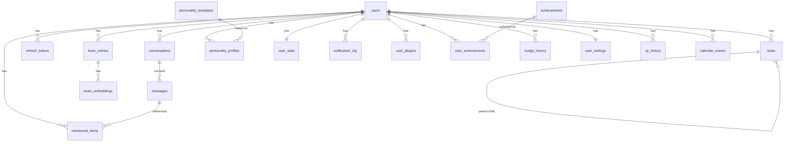

# Datenbankschema

**Letzte Aenderung:** 2026-02-06
**Letzte Migration:** 003_phase3_tables
**Datenbank:** PostgreSQL 16 + pgvector Extension
**ORM:** SQLAlchemy 2.0 (async)
**Migrationen:** Alembic

> Single Source of Truth -- wird ausschliesslich vom Database Manager gepflegt.
> Dieses Dokument beschreibt das DESIGN. Die Implementierung erfolgt durch den Database Manager.

---

## Inhaltsverzeichnis

1. [ER-Diagramm](#er-diagramm)
2. [Konventionen](#konventionen)
3. [Phase 1: Foundation](#phase-1-foundation)
4. [Phase 2: Core Features](#phase-2-core-features)
5. [Phase 3: ADHS-Modus](#phase-3-adhs-modus)
6. [Phase 4: Plugins & Calendar](#phase-4-plugins--calendar)
7. [Enums](#enums)
8. [Indizes](#indizes)

---

## ER-Diagramm



---

## Konventionen

| Konvention | Regel |
|---|---|
| Primary Key | `id UUID DEFAULT gen_random_uuid()` |
| Timestamps | `created_at TIMESTAMPTZ DEFAULT now()`, `updated_at TIMESTAMPTZ DEFAULT now()` |
| Foreign Keys | `{entity}_id UUID REFERENCES {entity}(id) ON DELETE CASCADE` |
| Soft Delete | NICHT verwendet. Loeschung ist hart (DSGVO Recht auf Loeschung). |
| Naming | Snake_case, Plural fuer Tabellennamen |
| Enums | PostgreSQL native ENUM Types |
| JSONB | Fuer flexible, schema-lose Daten (metadata, settings, traits) |
| Text Arrays | PostgreSQL `TEXT[]` fuer Tags |

---

## Phase 1: Foundation

### Tabelle: `users`

Speichert alle registrierten Benutzer.

| Spalte | Typ | Constraints | Beschreibung |
|---|---|---|---|
| `id` | `UUID` | `PK, DEFAULT gen_random_uuid()` | Eindeutige Benutzer-ID |
| `email` | `VARCHAR(255)` | `NOT NULL, UNIQUE` | E-Mail-Adresse (Login) |
| `password_hash` | `VARCHAR(255)` | `NOT NULL` | bcrypt Hash des Passworts |
| `display_name` | `VARCHAR(100)` | `NOT NULL` | Anzeigename |
| `avatar_url` | `VARCHAR(500)` | `NULL` | URL zum Profilbild |
| `is_active` | `BOOLEAN` | `NOT NULL, DEFAULT true` | Account aktiv? |
| `device_token` | `VARCHAR(255)` | `NULL` | Expo Push Notification Token |
| `timezone` | `VARCHAR(50)` | `NOT NULL, DEFAULT 'Europe/Berlin'` | Zeitzone des Nutzers |
| `preferences` | `JSONB` | `NOT NULL, DEFAULT '{}'` | Nutzer-Einstellungen (ADHS-Modus, Quiet Hours, etc.) |
| `created_at` | `TIMESTAMPTZ` | `NOT NULL, DEFAULT now()` | Erstellungszeitpunkt |
| `updated_at` | `TIMESTAMPTZ` | `NOT NULL, DEFAULT now()` | Letzter Update-Zeitpunkt |

**Indizes:**
- `ix_users_email` UNIQUE auf `email`
- `ix_users_is_active` auf `is_active`

**Constraints:**
- `email` muss ein gueltiges E-Mail-Format haben (Validierung via Pydantic, nicht DB)
- `password_hash` darf nie im API-Response enthalten sein

**Hinweis Phase 1:** Folgende Felder aus dem ursprünglichen Design wurden in Phase 1 noch NICHT implementiert:
- `device_token` (wird in Phase 3 mit Notifications hinzugefuegt)
- `timezone` (wird bei Bedarf hinzugefuegt)
- `preferences` JSONB (wird in Phase 2/3 hinzugefuegt)

Diese Felder werden in späteren Migrationen ergänzt.

---

### Tabelle: `refresh_tokens`

Speichert JWT Refresh Tokens fuer die Authentifizierung.

| Spalte | Typ | Constraints | Beschreibung |
|---|---|---|---|
| `id` | `UUID` | `PK, DEFAULT gen_random_uuid()` | Eindeutige Token-ID |
| `user_id` | `UUID` | `NOT NULL, FK -> users(id) ON DELETE CASCADE` | Zugehoeriger Benutzer |
| `token` | `VARCHAR(500)` | `NOT NULL, UNIQUE` | Refresh Token String |
| `expires_at` | `TIMESTAMPTZ` | `NOT NULL` | Ablaufzeitpunkt |
| `is_revoked` | `BOOLEAN` | `NOT NULL, DEFAULT false` | Wurde Token widerrufen? |
| `created_at` | `TIMESTAMPTZ` | `NOT NULL, DEFAULT now()` | Erstellungszeitpunkt |
| `updated_at` | `TIMESTAMPTZ` | `NOT NULL, DEFAULT now()` | Letzter Update-Zeitpunkt |

**Indizes:**
- `ix_refresh_tokens_user_id` auf `user_id`
- `ix_refresh_tokens_token` UNIQUE auf `token`

---

### Tabelle: `conversations`

Speichert Chat-Konversationen eines Nutzers.

| Spalte | Typ | Constraints | Beschreibung |
|---|---|---|---|
| `id` | `UUID` | `PK, DEFAULT gen_random_uuid()` | Eindeutige Konversations-ID |
| `user_id` | `UUID` | `NOT NULL, FK -> users(id) ON DELETE CASCADE` | Zugehoeriger Benutzer |
| `title` | `VARCHAR(255)` | `NULL` | Titel der Konversation (auto-generiert oder manuell) |
| `created_at` | `TIMESTAMPTZ` | `NOT NULL, DEFAULT now()` | Erstellungszeitpunkt |
| `updated_at` | `TIMESTAMPTZ` | `NOT NULL, DEFAULT now()` | Letzte Aktivitaet |

**Indizes:**
- `ix_conversations_user_id` auf `user_id`

**Hinweis:** `is_archived` Feld wurde in Phase 1 entfernt, kann spaeter hinzugefuegt werden wenn noetig.

---

### Tabelle: `messages`

Speichert einzelne Nachrichten innerhalb einer Konversation.

| Spalte | Typ | Constraints | Beschreibung |
|---|---|---|---|
| `id` | `UUID` | `PK, DEFAULT gen_random_uuid()` | Eindeutige Nachrichten-ID |
| `conversation_id` | `UUID` | `NOT NULL, FK -> conversations(id) ON DELETE CASCADE` | Zugehoerige Konversation |
| `role` | `message_role` | `NOT NULL` | Rolle: `user`, `assistant`, `system` |
| `content` | `TEXT` | `NOT NULL` | Nachrichteninhalt |
| `metadata` | `JSONB` | `NOT NULL, DEFAULT '{}'` | Zusaetzliche Metadaten |
| `token_count` | `INTEGER` | `NULL` | Anzahl der Tokens (fuer Kosten-Tracking) |
| `created_at` | `TIMESTAMPTZ` | `NOT NULL, DEFAULT now()` | Erstellungszeitpunkt |

**Indizes:**
- `ix_messages_conversation_id` auf `conversation_id`

**Hinweis:** `token_count` Feld wurde aus Phase 1 entfernt (kann aus metadata extrahiert werden).
Composite Index `ix_messages_conversation_created` kann spaeter hinzugefuegt werden bei Bedarf.

**`metadata` JSONB Struktur (Beispiel fuer Assistant-Nachricht):**
```json
{
  "model": "claude-3-5-sonnet",
  "total_tokens": 450,
  "prompt_tokens": 300,
  "completion_tokens": 150,
  "duration_ms": 1200,
  "agents_used": ["orchestrator", "brain_searcher"],
  "mentioned_items_extracted": 2
}
```

---

## Phase 2: Core Features

### Tabelle: `tasks`

Speichert Aufgaben des Nutzers. Unterstuetzt Hierarchie (Parent-Child) fuer Task-Breakdown.

| Spalte | Typ | Constraints | Beschreibung |
|---|---|---|---|
| `id` | `UUID` | `PK, DEFAULT gen_random_uuid()` | Eindeutige Task-ID |
| `user_id` | `UUID` | `NOT NULL, FK -> users(id) ON DELETE CASCADE` | Zugehoeriger Benutzer |
| `title` | `VARCHAR(500)` | `NOT NULL` | Task-Titel |
| `description` | `TEXT` | `NULL` | Ausfuehrliche Beschreibung |
| `priority` | `task_priority` | `NOT NULL, DEFAULT 'medium'` | Prioritaet: `low`, `medium`, `high`, `urgent` |
| `status` | `task_status` | `NOT NULL, DEFAULT 'open'` | Status: `open`, `in_progress`, `done`, `cancelled` |
| `due_date` | `TIMESTAMPTZ` | `NULL` | Faelligkeitsdatum |
| `completed_at` | `TIMESTAMPTZ` | `NULL` | Erledigungszeitpunkt |
| `xp_earned` | `INTEGER` | `NOT NULL, DEFAULT 0` | Verdiente XP bei Erledigung |
| `parent_id` | `UUID` | `NULL, FK -> tasks(id) ON DELETE CASCADE` | Eltern-Task (fuer Sub-Tasks) |
| `is_recurring` | `BOOLEAN` | `NOT NULL, DEFAULT false` | Wiederkehrender Task? |
| `recurrence_rule` | `VARCHAR(255)` | `NULL` | iCal RRULE (z.B. `FREQ=DAILY;INTERVAL=1`) |
| `tags` | `TEXT[]` | `NOT NULL, DEFAULT '{}'` | Tags fuer Kategorisierung |
| `source` | `task_source` | `NOT NULL, DEFAULT 'manual'` | Herkunft: `manual`, `chat_extract`, `breakdown`, `recurring` |
| `source_message_id` | `UUID` | `NULL, FK -> messages(id) ON DELETE SET NULL` | Nachricht, aus der der Task extrahiert wurde |
| `estimated_minutes` | `INTEGER` | `NULL` | Geschaetzte Dauer in Minuten |
| `created_at` | `TIMESTAMPTZ` | `NOT NULL, DEFAULT now()` | Erstellungszeitpunkt |
| `updated_at` | `TIMESTAMPTZ` | `NOT NULL, DEFAULT now()` | Letzter Update-Zeitpunkt |

**Indizes:**
- `ix_tasks_user_id` auf `user_id`
- `ix_tasks_user_status` auf `(user_id, status)` -- fuer gefilterte Task-Listen
- `ix_tasks_user_due_date` auf `(user_id, due_date)` -- fuer Deadline-Monitor
- `ix_tasks_parent_id` auf `parent_id` -- fuer Sub-Task-Abfragen
- `ix_tasks_user_status_due` auf `(user_id, status, due_date)` -- fuer "heute faellige Tasks"
- `ix_tasks_tags` GIN auf `tags` -- fuer Tag-basierte Suche

**Constraints:**
- `CHECK (parent_id != id)` -- Task kann nicht sein eigener Parent sein
- `CHECK (completed_at IS NULL OR status = 'done')` -- completed_at nur bei Status done

---

### Tabelle: `brain_entries`

Speichert Wissenseintraege im Second Brain.

| Spalte | Typ | Constraints | Beschreibung |
|---|---|---|---|
| `id` | `UUID` | `PK, DEFAULT gen_random_uuid()` | Eindeutige Eintrags-ID |
| `user_id` | `UUID` | `NOT NULL, FK -> users(id) ON DELETE CASCADE` | Zugehoeriger Benutzer |
| `title` | `VARCHAR(500)` | `NOT NULL` | Titel des Eintrags |
| `content` | `TEXT` | `NOT NULL` | Inhalt (Volltext) |
| `entry_type` | `brain_entry_type` | `NOT NULL, DEFAULT 'manual'` | Typ: `manual`, `chat_extract`, `url_import`, `file_import`, `voice_note` |
| `tags` | `TEXT[]` | `NOT NULL, DEFAULT '{}'` | Tags fuer Kategorisierung |
| `source_url` | `VARCHAR(2000)` | `NULL` | Quell-URL (bei Import) |
| `metadata` | `JSONB` | `NOT NULL, DEFAULT '{}'` | Zusaetzliche Metadaten |
| `embedding_status` | `embedding_status` | `NOT NULL, DEFAULT 'pending'` | Status: `pending`, `processing`, `completed`, `failed` |
| `created_at` | `TIMESTAMPTZ` | `NOT NULL, DEFAULT now()` | Erstellungszeitpunkt |
| `updated_at` | `TIMESTAMPTZ` | `NOT NULL, DEFAULT now()` | Letzter Update-Zeitpunkt |

**Indizes:**
- `ix_brain_entries_user_id` auf `user_id`
- `ix_brain_entries_user_type` auf `(user_id, entry_type)`
- `ix_brain_entries_tags` GIN auf `tags`
- `ix_brain_entries_user_created` auf `(user_id, created_at DESC)`

**`metadata` JSONB Struktur:**
```json
{
  "word_count": 350,
  "language": "de",
  "file_name": "notes.pdf",
  "file_size_bytes": 125000,
  "chunk_count": 3,
  "related_entry_ids": ["uuid1", "uuid2"]
}
```

---

### Tabelle: `brain_embeddings`

Speichert Vektor-Embeddings fuer Brain-Eintraege (Chunks). Verwendet pgvector.

| Spalte | Typ | Constraints | Beschreibung |
|---|---|---|---|
| `id` | `UUID` | `PK, DEFAULT gen_random_uuid()` | Eindeutige Embedding-ID |
| `entry_id` | `UUID` | `NOT NULL, FK -> brain_entries(id) ON DELETE CASCADE` | Zugehoeriger Brain-Eintrag |
| `user_id` | `UUID` | `NOT NULL, FK -> users(id) ON DELETE CASCADE` | Zugehoeriger Benutzer (denormalisiert fuer schnelle Filterung) |
| `chunk_text` | `TEXT` | `NOT NULL` | Text-Chunk |
| `embedding` | `VECTOR(384)` | `NOT NULL` | Vektor-Embedding (Sentence Transformers, 384 Dimensionen) |
| `chunk_index` | `INTEGER` | `NOT NULL` | Position des Chunks im Originaltext |

**Indizes:**
- `ix_brain_embeddings_entry_id` auf `entry_id`
- `ix_brain_embeddings_user_id` auf `user_id`
- `ix_brain_embeddings_vector` HNSW auf `embedding` mit `vector_cosine_ops` -- fuer effiziente Similarity-Suche

**Hinweis zum HNSW Index:**
```sql
CREATE INDEX ix_brain_embeddings_vector
ON brain_embeddings
USING hnsw (embedding vector_cosine_ops)
WITH (m = 16, ef_construction = 64);
```

---

### Tabelle: `mentioned_items`

Speichert automatisch aus Chat-Nachrichten extrahierte Erwaehungen (Tasks, Termine, Ideen, Follow-Ups).

| Spalte | Typ | Constraints | Beschreibung |
|---|---|---|---|
| `id` | `UUID` | `PK, DEFAULT gen_random_uuid()` | Eindeutige Item-ID |
| `user_id` | `UUID` | `NOT NULL, FK -> users(id) ON DELETE CASCADE` | Zugehoeriger Benutzer |
| `message_id` | `UUID` | `NOT NULL, FK -> messages(id) ON DELETE CASCADE` | Quell-Nachricht |
| `item_type` | `mentioned_item_type` | `NOT NULL` | Typ: `task`, `appointment`, `idea`, `follow_up`, `reminder` |
| `content` | `TEXT` | `NOT NULL` | Extrahierter Inhalt |
| `status` | `mentioned_item_status` | `NOT NULL, DEFAULT 'pending'` | Status: `pending`, `converted`, `dismissed`, `snoozed` |
| `extracted_data` | `JSONB` | `NOT NULL, DEFAULT '{}'` | Strukturierte extrahierte Daten |
| `converted_to_id` | `UUID` | `NULL` | ID des erstellten Tasks/Brain-Eintrags (nach Konvertierung) |
| `converted_to_type` | `VARCHAR(50)` | `NULL` | Typ: `task` oder `brain_entry` |
| `snoozed_until` | `TIMESTAMPTZ` | `NULL` | Snoozed bis (wenn Status = snoozed) |
| `created_at` | `TIMESTAMPTZ` | `NOT NULL, DEFAULT now()` | Erstellungszeitpunkt |

**Indizes:**
- `ix_mentioned_items_user_id` auf `user_id`
- `ix_mentioned_items_user_status` auf `(user_id, status)` -- fuer "offene Items" Abfrage
- `ix_mentioned_items_message_id` auf `message_id`

**`extracted_data` JSONB Struktur (Beispiel fuer Task):**
```json
{
  "suggested_title": "Arzttermin vereinbaren",
  "suggested_priority": "high",
  "suggested_due_date": "2026-02-10",
  "confidence": 0.92,
  "context_snippet": "Ich muss unbedingt diese Woche noch..."
}
```

---

### Tabelle: `personality_profiles`

Speichert anpassbare Persoenlichkeitsprofile fuer ALICE.

| Spalte | Typ | Constraints | Beschreibung |
|---|---|---|---|
| `id` | `UUID` | `PK, DEFAULT gen_random_uuid()` | Eindeutige Profil-ID |
| `user_id` | `UUID` | `NOT NULL, FK -> users(id) ON DELETE CASCADE` | Zugehoeriger Benutzer |
| `name` | `VARCHAR(100)` | `NOT NULL` | Profilname (z.B. "Mein Coach") |
| `is_active` | `BOOLEAN` | `NOT NULL, DEFAULT false` | Aktives Profil? (nur eins pro User) |
| `template_id` | `UUID` | `NULL, FK -> personality_templates(id) ON DELETE SET NULL` | Basierendes Template |
| `traits` | `JSONB` | `NOT NULL, DEFAULT '{}'` | Persoenlichkeits-Traits (Slider-Werte) |
| `rules` | `JSONB` | `NOT NULL, DEFAULT '[]'` | Custom Rules (Array) |
| `voice_style` | `JSONB` | `NOT NULL, DEFAULT '{}'` | Voice-Konfiguration (TTS-Parameter) |
| `custom_instructions` | `TEXT` | `NULL` | Freitext: Zusaetzliche Anweisungen |
| `created_at` | `TIMESTAMPTZ` | `NOT NULL, DEFAULT now()` | Erstellungszeitpunkt |
| `updated_at` | `TIMESTAMPTZ` | `NOT NULL, DEFAULT now()` | Letzter Update-Zeitpunkt |

**Indizes:**
- `ix_personality_profiles_user_id` auf `user_id`
- `ix_personality_profiles_user_active` UNIQUE partial auf `(user_id) WHERE is_active = true` -- max 1 aktives Profil pro User

**`traits` JSONB Struktur:**
```json
{
  "formality": 30,
  "humor": 60,
  "strictness": 50,
  "empathy": 80,
  "verbosity": 40
}
```

**`rules` JSONB Struktur:**
```json
[
  {"id": "uuid", "text": "Sprich mich mit Du an", "enabled": true},
  {"id": "uuid", "text": "Verwende keine Emojis", "enabled": true},
  {"id": "uuid", "text": "Antworte auf Deutsch", "enabled": true}
]
```

**`voice_style` JSONB Struktur:**
```json
{
  "voice_id": "elevenlabs-voice-id",
  "speed": 1.0,
  "pitch": 0,
  "emotion": "friendly"
}
```

---

### Tabelle: `personality_templates`

Vordefinierte Persoenlichkeits-Templates als Ausgangspunkt.

| Spalte | Typ | Constraints | Beschreibung |
|---|---|---|---|
| `id` | `UUID` | `PK, DEFAULT gen_random_uuid()` | Eindeutige Template-ID |
| `name` | `VARCHAR(100)` | `NOT NULL, UNIQUE` | Template-Name |
| `description` | `TEXT` | `NOT NULL` | Beschreibung des Templates |
| `traits` | `JSONB` | `NOT NULL` | Vorgegebene Trait-Werte |
| `rules` | `JSONB` | `NOT NULL, DEFAULT '[]'` | Vorgegebene Rules |
| `is_default` | `BOOLEAN` | `NOT NULL, DEFAULT false` | Standard-Template fuer neue User? |
| `icon` | `VARCHAR(50)` | `NULL` | Icon-Bezeichnung (z.B. "shield", "heart") |
| `created_at` | `TIMESTAMPTZ` | `NOT NULL, DEFAULT now()` | Erstellungszeitpunkt |

**Seed-Daten (4 Templates):**

1. **Strenger Coach:** formality=70, humor=20, strictness=90, empathy=40, verbosity=30
2. **Freundlicher Begleiter:** formality=20, humor=70, strictness=20, empathy=90, verbosity=60
3. **Sachlicher Assistent:** formality=80, humor=10, strictness=50, empathy=50, verbosity=40
4. **Motivierende Cheerleaderin:** formality=10, humor=80, strictness=30, empathy=80, verbosity=70

---

## Phase 3: ADHS-Modus

**Migration:** `003_phase3_tables` (implementiert: user_stats, achievements, user_achievements, nudge_history, user_settings)

### Tabelle: `user_stats`

Speichert aggregierte Gamification-Statistiken pro Nutzer. 1:1 Beziehung zu `users`.

| Spalte | Typ | Constraints | Beschreibung |
|---|---|---|---|
| `id` | `UUID` | `PK, DEFAULT gen_random_uuid()` | Eindeutige Stats-ID |
| `user_id` | `UUID` | `NOT NULL, UNIQUE, FK -> users(id) ON DELETE CASCADE` | Zugehoeriger Benutzer |
| `total_xp` | `INTEGER` | `NOT NULL, DEFAULT 0` | Gesamt-XP |
| `level` | `INTEGER` | `NOT NULL, DEFAULT 1` | Aktuelles Level |
| `current_streak` | `INTEGER` | `NOT NULL, DEFAULT 0` | Aktuelle Streak (aufeinanderfolgende produktive Tage) |
| `longest_streak` | `INTEGER` | `NOT NULL, DEFAULT 0` | Laengste Streak aller Zeiten |
| `last_active_date` | `DATE` | `NULL` | Letzter Tag mit erledigtem Task |
| `tasks_completed` | `INTEGER` | `NOT NULL, DEFAULT 0` | Gesamtzahl erledigter Tasks |
| `created_at` | `TIMESTAMPTZ` | `NOT NULL, DEFAULT now()` | Erstellungszeitpunkt |
| `updated_at` | `TIMESTAMPTZ` | `NOT NULL, DEFAULT now()` | Letzter Update-Zeitpunkt |

**Indizes:**
- `ix_user_stats_user_id` UNIQUE auf `user_id`

**Level-Berechnung:**
```
level = floor(sqrt(total_xp / 100))
```

**Streak-Logik:**
- Streak erhoeht sich um 1 wenn `last_active_date = gestern` und heute ein Task erledigt wird.
- Streak wird auf 1 gesetzt wenn `last_active_date < gestern` und heute ein Task erledigt wird.
- `longest_streak` wird aktualisiert wenn `current_streak > longest_streak`.

---

### Tabelle: `achievements`

Definiert die verfuegbaren Achievements (Seed-Daten, nicht User-spezifisch).

| Spalte | Typ | Constraints | Beschreibung |
|---|---|---|---|
| `id` | `UUID` | `PK, DEFAULT gen_random_uuid()` | Eindeutige Achievement-ID |
| `name` | `VARCHAR(255)` | `NOT NULL, UNIQUE` | Achievement-Name |
| `description` | `TEXT` | `NOT NULL` | Beschreibung |
| `icon` | `VARCHAR(100)` | `NOT NULL` | Icon-Bezeichnung (Emoji oder Icon-Name) |
| `category` | `achievement_category` | `NOT NULL` | Kategorie: `task`, `streak`, `brain`, `social`, `special` |
| `condition_type` | `VARCHAR(100)` | `NOT NULL` | Bedingungstyp (z.B. `tasks_completed`, `streak_days`, `brain_entries`) |
| `condition_value` | `INTEGER` | `NOT NULL` | Schwellenwert fuer die Bedingung |
| `xp_reward` | `INTEGER` | `NOT NULL, DEFAULT 0` | XP-Belohnung bei Freischaltung |
| `is_active` | `BOOLEAN` | `NOT NULL, DEFAULT true` | Achievement aktiv? |
| `created_at` | `TIMESTAMPTZ` | `NOT NULL, DEFAULT now()` | Erstellungszeitpunkt |
| `updated_at` | `TIMESTAMPTZ` | `NOT NULL, DEFAULT now()` | Letzter Update-Zeitpunkt |

**Indizes:**
- `ix_achievements_category` auf `category`
- `ix_achievements_name` UNIQUE auf `name`

**Seed-Daten (8 Achievements):**

| Name | Kategorie | condition_type | condition_value | XP | Icon |
|---|---|---|---|---|---|
| First Steps | task | tasks_completed | 1 | 50 | target |
| Getting Things Done | task | tasks_completed | 10 | 100 | check |
| Century Club | task | tasks_completed | 100 | 500 | 100 |
| Week Warrior | streak | streak_days | 7 | 150 | fire |
| Dedicated | streak | streak_days | 30 | 500 | star |
| Brain Scholar | brain | brain_entries | 10 | 100 | brain |
| Knowledge Base | brain | brain_entries | 50 | 300 | books |
| Speed Demon | special | task_under_5min | 1 | 75 | lightning |

---

### Tabelle: `user_achievements`

Speichert freigeschaltete Achievements pro Nutzer.

| Spalte | Typ | Constraints | Beschreibung |
|---|---|---|---|
| `id` | `UUID` | `PK, DEFAULT gen_random_uuid()` | Eindeutige ID |
| `user_id` | `UUID` | `NOT NULL, FK -> users(id) ON DELETE CASCADE` | Zugehoeriger Benutzer |
| `achievement_id` | `UUID` | `NOT NULL, FK -> achievements(id) ON DELETE CASCADE` | Freigeschaltetes Achievement |
| `unlocked_at` | `TIMESTAMPTZ` | `NOT NULL, DEFAULT now()` | Zeitpunkt der Freischaltung |
| `created_at` | `TIMESTAMPTZ` | `NOT NULL, DEFAULT now()` | Erstellungszeitpunkt |
| `updated_at` | `TIMESTAMPTZ` | `NOT NULL, DEFAULT now()` | Letzter Update-Zeitpunkt |

**Indizes:**
- `ix_user_achievements_user_id` auf `user_id`
- `ix_user_achievements_achievement_id` auf `achievement_id`
- `uq_user_achievements_user_achievement` UNIQUE auf `(user_id, achievement_id)` -- jedes Achievement nur einmal

---

### Tabelle: `nudge_history`

Protokolliert alle gesendeten Nudges/Erinnerungen fuer den ADHS-Modus.

| Spalte | Typ | Constraints | Beschreibung |
|---|---|---|---|
| `id` | `UUID` | `PK, DEFAULT gen_random_uuid()` | Eindeutige Nudge-ID |
| `user_id` | `UUID` | `NOT NULL, FK -> users(id) ON DELETE CASCADE` | Zugehoeriger Benutzer |
| `task_id` | `UUID` | `NULL, FK -> tasks(id) ON DELETE SET NULL` | Zugehoeriger Task (optional) |
| `nudge_level` | `INTEGER` | `NOT NULL, DEFAULT 1` | Eskalationsstufe: 1=freundlich, 2=bestimmt, 3=dringlich |
| `nudge_type` | `nudge_type` | `NOT NULL` | Typ: `follow_up`, `deadline`, `streak_reminder`, `motivational` |
| `message` | `TEXT` | `NOT NULL` | Nudge-Nachricht |
| `delivered_at` | `TIMESTAMPTZ` | `NOT NULL, DEFAULT now()` | Versandzeitpunkt |
| `acknowledged_at` | `TIMESTAMPTZ` | `NULL` | Bestaetigungszeitpunkt |
| `created_at` | `TIMESTAMPTZ` | `NOT NULL, DEFAULT now()` | Erstellungszeitpunkt |
| `updated_at` | `TIMESTAMPTZ` | `NOT NULL, DEFAULT now()` | Letzter Update-Zeitpunkt |

**Indizes:**
- `ix_nudge_history_user_id` auf `user_id`
- `ix_nudge_history_user_unack` partial auf `(user_id) WHERE acknowledged_at IS NULL` -- fuer unbestaetigte Nudges

---

### Tabelle: `user_settings`

Speichert ADHS-spezifische Einstellungen pro Nutzer als JSONB. 1:1 Beziehung zu `users`.

| Spalte | Typ | Constraints | Beschreibung |
|---|---|---|---|
| `id` | `UUID` | `PK, DEFAULT gen_random_uuid()` | Eindeutige Settings-ID |
| `user_id` | `UUID` | `NOT NULL, UNIQUE, FK -> users(id) ON DELETE CASCADE` | Zugehoeriger Benutzer |
| `settings` | `JSONB` | `NOT NULL, DEFAULT (siehe unten)` | Einstellungs-Blob |
| `created_at` | `TIMESTAMPTZ` | `NOT NULL, DEFAULT now()` | Erstellungszeitpunkt |
| `updated_at` | `TIMESTAMPTZ` | `NOT NULL, DEFAULT now()` | Letzter Update-Zeitpunkt |

**Indizes:**
- `ix_user_settings_user_id` UNIQUE auf `user_id`

**Default `settings` JSONB:**
```json
{
  "adhs_mode": true,
  "nudge_intensity": "medium",
  "auto_breakdown": true,
  "gamification_enabled": true,
  "focus_timer_minutes": 25,
  "quiet_hours_start": "22:00",
  "quiet_hours_end": "07:00",
  "preferred_reminder_times": ["09:00", "14:00", "18:00"]
}
```

---

### Noch nicht implementiert (Phase 3, spaetere Migration):

- `xp_history` -- Einzelne XP-Vergaben fuer Nachvollziehbarkeit
- `notification_log` -- Vollstaendiges Notification-Protokoll

---

## Phase 4: Plugins & Calendar

### Tabelle: `user_plugins`

Speichert installierte Plugins pro Nutzer.

| Spalte | Typ | Constraints | Beschreibung |
|---|---|---|---|
| `id` | `UUID` | `PK, DEFAULT gen_random_uuid()` | Eindeutige ID |
| `user_id` | `UUID` | `NOT NULL, FK -> users(id) ON DELETE CASCADE` | Zugehoeriger Benutzer |
| `plugin_id` | `VARCHAR(100)` | `NOT NULL` | Plugin-Identifier (z.B. `google_calendar`, `n8n_bridge`) |
| `is_enabled` | `BOOLEAN` | `NOT NULL, DEFAULT true` | Plugin aktiviert? |
| `settings` | `JSONB` | `NOT NULL, DEFAULT '{}'` | Plugin-spezifische Einstellungen |
| `auth_data` | `BYTEA` | `NULL` | Verschluesselte Auth-Daten (OAuth Tokens, API Keys) |
| `installed_at` | `TIMESTAMPTZ` | `NOT NULL, DEFAULT now()` | Installationszeitpunkt |
| `updated_at` | `TIMESTAMPTZ` | `NOT NULL, DEFAULT now()` | Letzter Update-Zeitpunkt |

**Indizes:**
- `ix_user_plugins_user_id` auf `user_id`
- `uq_user_plugins_user_plugin` UNIQUE auf `(user_id, plugin_id)` -- Plugin nur einmal pro User

**Hinweis `auth_data`:**
- Gespeichert als `BYTEA` (binary), verschluesselt mit AES-256-GCM.
- Encryption Key wird aus Environment Variable geladen, NICHT in der Datenbank gespeichert.
- Enthaelt z.B. OAuth2 Access Token, Refresh Token, API Keys.

**`settings` JSONB Struktur (Beispiel Google Calendar):**
```json
{
  "sync_interval_minutes": 15,
  "calendars": ["primary", "work"],
  "sync_direction": "read_only",
  "include_declined": false
}
```

---

### Tabelle: `plugin_data`

Generischer Key-Value Store fuer Plugin-spezifische Daten.

| Spalte | Typ | Constraints | Beschreibung |
|---|---|---|---|
| `id` | `UUID` | `PK, DEFAULT gen_random_uuid()` | Eindeutige ID |
| `user_id` | `UUID` | `NOT NULL, FK -> users(id) ON DELETE CASCADE` | Zugehoeriger Benutzer |
| `plugin_id` | `VARCHAR(100)` | `NOT NULL` | Plugin-Identifier |
| `data_key` | `VARCHAR(255)` | `NOT NULL` | Daten-Schluessel |
| `data_value` | `JSONB` | `NOT NULL` | Daten-Wert |
| `created_at` | `TIMESTAMPTZ` | `NOT NULL, DEFAULT now()` | Erstellungszeitpunkt |
| `updated_at` | `TIMESTAMPTZ` | `NOT NULL, DEFAULT now()` | Letzter Update-Zeitpunkt |

**Indizes:**
- `ix_plugin_data_user_plugin` auf `(user_id, plugin_id)`
- `uq_plugin_data_user_plugin_key` UNIQUE auf `(user_id, plugin_id, data_key)` -- ein Key pro User+Plugin

---

### Tabelle: `calendar_events`

Speichert gecachte Kalender-Events (aus Google Calendar oder anderen Quellen).

| Spalte | Typ | Constraints | Beschreibung |
|---|---|---|---|
| `id` | `UUID` | `PK, DEFAULT gen_random_uuid()` | Eindeutige Event-ID |
| `user_id` | `UUID` | `NOT NULL, FK -> users(id) ON DELETE CASCADE` | Zugehoeriger Benutzer |
| `external_id` | `VARCHAR(500)` | `NOT NULL` | ID im externen System (Google Event ID) |
| `title` | `VARCHAR(500)` | `NOT NULL` | Event-Titel |
| `description` | `TEXT` | `NULL` | Event-Beschreibung |
| `start_time` | `TIMESTAMPTZ` | `NOT NULL` | Startzeit |
| `end_time` | `TIMESTAMPTZ` | `NOT NULL` | Endzeit |
| `location` | `VARCHAR(500)` | `NULL` | Ort |
| `is_all_day` | `BOOLEAN` | `NOT NULL, DEFAULT false` | Ganztaegiges Event? |
| `source` | `VARCHAR(50)` | `NOT NULL, DEFAULT 'google_calendar'` | Quelle des Events |
| `raw_data` | `JSONB` | `NOT NULL, DEFAULT '{}'` | Rohdaten vom externen System |
| `synced_at` | `TIMESTAMPTZ` | `NOT NULL, DEFAULT now()` | Letzter Sync-Zeitpunkt |
| `created_at` | `TIMESTAMPTZ` | `NOT NULL, DEFAULT now()` | Erstellungszeitpunkt |
| `updated_at` | `TIMESTAMPTZ` | `NOT NULL, DEFAULT now()` | Letzter Update-Zeitpunkt |

**Indizes:**
- `ix_calendar_events_user_id` auf `user_id`
- `ix_calendar_events_user_start` auf `(user_id, start_time)` -- fuer Tagesansicht
- `uq_calendar_events_user_external` UNIQUE auf `(user_id, external_id, source)` -- keine Duplikate

---

## Enums

Alle Enums als PostgreSQL native ENUM Types:

```sql
-- Phase 1
CREATE TYPE message_role AS ENUM ('user', 'assistant', 'system');

-- Phase 2
CREATE TYPE task_priority AS ENUM ('low', 'medium', 'high', 'urgent');
CREATE TYPE task_status AS ENUM ('open', 'in_progress', 'done', 'cancelled');
CREATE TYPE task_source AS ENUM ('manual', 'chat_extract', 'breakdown', 'recurring');

CREATE TYPE brain_entry_type AS ENUM ('manual', 'chat_extract', 'url_import', 'file_import', 'voice_note');
CREATE TYPE embedding_status AS ENUM ('pending', 'processing', 'completed', 'failed');

CREATE TYPE mentioned_item_type AS ENUM ('task', 'appointment', 'idea', 'follow_up', 'reminder');
CREATE TYPE mentioned_item_status AS ENUM ('pending', 'converted', 'dismissed', 'snoozed');

-- Phase 3 (implementiert in 003_phase3_tables)
CREATE TYPE achievement_category AS ENUM ('task', 'streak', 'brain', 'social', 'special');
CREATE TYPE nudge_type AS ENUM ('follow_up', 'deadline', 'streak_reminder', 'motivational');

-- Phase 3 (noch nicht implementiert)
-- CREATE TYPE xp_source AS ENUM ('task_complete', 'streak_bonus', 'achievement', 'daily_bonus');
-- CREATE TYPE notification_type AS ENUM (
--     'daily_plan', 'task_reminder', 'deadline_warning', 'follow_up',
--     'nudge', 'achievement', 'streak', 'level_up', 'system'
-- );
```

---

## Indizes

### Zusammenfassung aller Indizes

| Tabelle | Index-Name | Spalten | Typ | Zweck |
|---|---|---|---|---|
| users | ix_users_email | email | UNIQUE, BTREE | Login-Lookup |
| users | ix_users_is_active | is_active | BTREE | Aktive User filtern |
| conversations | ix_conversations_user_id | user_id | BTREE | User-Konversationen |
| conversations | ix_conversations_user_updated | user_id, updated_at DESC | BTREE | Sortierte Liste |
| messages | ix_messages_conversation_id | conversation_id | BTREE | Nachrichten einer Konversation |
| messages | ix_messages_conversation_created | conversation_id, created_at ASC | BTREE | Chronologische Nachrichten |
| tasks | ix_tasks_user_id | user_id | BTREE | User-Tasks |
| tasks | ix_tasks_user_status | user_id, status | BTREE | Gefilterte Task-Listen |
| tasks | ix_tasks_user_due_date | user_id, due_date | BTREE | Deadline-Monitor |
| tasks | ix_tasks_parent_id | parent_id | BTREE | Sub-Tasks |
| tasks | ix_tasks_user_status_due | user_id, status, due_date | BTREE | Heutige Tasks |
| tasks | ix_tasks_tags | tags | GIN | Tag-Suche |
| brain_entries | ix_brain_entries_user_id | user_id | BTREE | User-Eintraege |
| brain_entries | ix_brain_entries_user_type | user_id, entry_type | BTREE | Typ-Filter |
| brain_entries | ix_brain_entries_tags | tags | GIN | Tag-Suche |
| brain_entries | ix_brain_entries_user_created | user_id, created_at DESC | BTREE | Chronologische Liste |
| brain_embeddings | ix_brain_embeddings_entry_id | entry_id | BTREE | Chunks eines Eintrags |
| brain_embeddings | ix_brain_embeddings_user_id | user_id | BTREE | User-Filterung |
| brain_embeddings | ix_brain_embeddings_vector | embedding | HNSW (cosine) | Vektor-Similarity |
| mentioned_items | ix_mentioned_items_user_id | user_id | BTREE | User-Items |
| mentioned_items | ix_mentioned_items_user_status | user_id, status | BTREE | Offene Items |
| mentioned_items | ix_mentioned_items_message_id | message_id | BTREE | Items einer Nachricht |
| personality_profiles | ix_personality_profiles_user_id | user_id | BTREE | User-Profile |
| personality_profiles | ix_personality_profiles_user_active | user_id (WHERE is_active) | UNIQUE PARTIAL | Max 1 aktiv |
| user_stats | ix_user_stats_user_id | user_id | UNIQUE, BTREE | 1:1 Lookup |
| achievements | ix_achievements_category | category | BTREE | Kategorie-Filter |
| achievements | ix_achievements_name | name | UNIQUE, BTREE | Name-Lookup |
| user_achievements | ix_user_achievements_user_id | user_id | BTREE | User-Achievements |
| user_achievements | ix_user_achievements_achievement_id | achievement_id | BTREE | Achievement-Lookup |
| user_achievements | uq_user_achievements_user_achievement | user_id, achievement_id | UNIQUE | Keine Duplikate |
| nudge_history | ix_nudge_history_user_id | user_id | BTREE | User-Nudges |
| nudge_history | ix_nudge_history_user_unack | user_id (WHERE acknowledged_at IS NULL) | PARTIAL | Unbestaetigte |
| user_settings | ix_user_settings_user_id | user_id | UNIQUE, BTREE | 1:1 Lookup |
| user_plugins | ix_user_plugins_user_id | user_id | BTREE | User-Plugins |
| user_plugins | uq_user_plugins_user_plugin | user_id, plugin_id | UNIQUE | Keine Duplikate |
| plugin_data | ix_plugin_data_user_plugin | user_id, plugin_id | BTREE | Plugin-Daten |
| plugin_data | uq_plugin_data_user_plugin_key | user_id, plugin_id, data_key | UNIQUE | Eindeutige Keys |
| calendar_events | ix_calendar_events_user_id | user_id | BTREE | User-Events |
| calendar_events | ix_calendar_events_user_start | user_id, start_time | BTREE | Tagesansicht |
| calendar_events | uq_calendar_events_user_external | user_id, external_id, source | UNIQUE | Keine Duplikate |

---

## Migrations-Reihenfolge

### Implementierte Migrationen

| Nr. | Revision ID | Tabellen | Phase |
|---|---|---|---|
| 001 | 001_initial_schema | users, conversations, messages, refresh_tokens, pgvector Extension, message_role ENUM | 1 |
| 002 | 002_phase2_tables | tasks, brain_entries, brain_embeddings, mentioned_items, personality_templates (+ Seed), personality_profiles, 7 ENUMs | 2 |
| 003 | 003_phase3_tables | user_stats, achievements (+ Seed), user_achievements, nudge_history, user_settings, 2 ENUMs | 3 |

### Geplante Migrationen

| Nr. | Migration | Tabellen | Phase |
|---|---|---|---|
| 004 | phase3_xp_history | xp_history, xp_source ENUM | 3 |
| 005 | phase3_notification_log | notification_log, notification_type ENUM | 3 |
| 006 | phase4_plugins | user_plugins, plugin_data | 4 |
| 007 | phase4_calendar | calendar_events | 4 |
